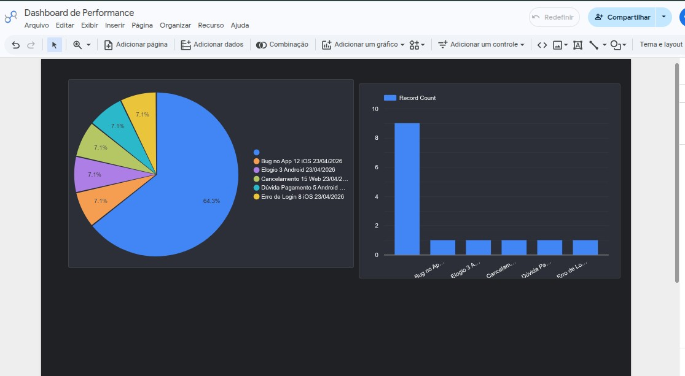
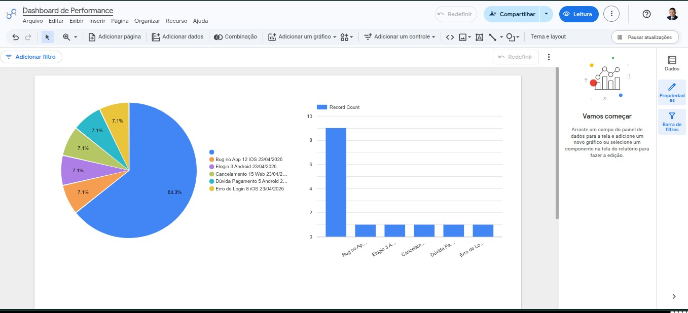

# 📊 MIS Intelligence & Product Decision
**Autor:** Roberlande Silva
# MIS Call Center Intelligence 📊

Este repositório foi desenvolvido para demonstrar competências avançadas em **MIS (Management Information System)**, Análise de Dados e Visão de Produto, focado em operações de Call Center de alto volume.

---

## 🚀 Sobre o Projetos

## 📊 Visualização de Dados (BI & Analytics)
O projeto utiliza **Tableau** e **Excel Power Query** para transformar a base CSV em dashboards executivos.

### Exemplo de Estrutura de Dados (Dataset):
| ID_Chamado | Motivo_Contato | Plataforma | Status |
| :--- | :--- | :--- | :--- |
| CH-001 | Erro de Login | iOS | Resolvido |
| CH-002 | Dúvida Pagamento | Web | Pendente |

> **Nota:** Para visualizar o dashboard interativo, consulte a pasta `/images` ou o relatório em PDF (em breve).

## 📊 Visualização do Projeto

Aqui podes ver o Dashboard em duas versões:

### Versão Dark (Recomendada)

### Versão Light

---
🔗 **[Clique aqui para abrir o Dashboard Interativo no Looker Studio](https://datastudio.google.com/s/iIJ6VV2HrO8)**
## ⚖️ Diferencial Estratégico (Híbrido)

Minha trajetória une **Engenharia de Software** e **Direito**, permitindo uma atuação diferenciada em MIS e Produtos:
* **Data Compliance:** Análise de métricas orientada pela LGPD e privacidade do usuário.
* **Governança de Dados:** Implementação de dicionários de dados e documentação técnica rigorosa.
* **Automação Sênior:** Desenvolvimento de scripts (Python/Shell) para otimização de fluxos operacionais, reduzindo o trabalho manual e erros humanos.

## 🛠️ O que você encontrará aqui:
* **Estruturação de KPIs:** Dashboards focados em Nível de Serviço (SL), TMA, TME e FCR.
* **Análise de Produto:** Identificação de causas raiz de chamados para apoio ao time de desenvolvimento (iOS/Android/Web).
* **Padronização:** Modelagem de dados limpa e escalável utilizando Excel (Power Query) e BI.
* **Geração de Insights:** Relatórios que explicam o "porquê" por trás dos indicadores operacionais.

## 📈 Métricas Monitoradas

* **Operacionais:** Absenteísmo, Turnover e Aderência de escala.
* **Estratégicas:** Correlação entre volumetria de suporte e lançamentos de novas features.
* **Financeiras:** Impacto de automações e redução de custo por contato.

---

## 📂 Estrutura do Repositório
* `/data`: Bases de dados simuladas para análise.
* `/insights`: Relatórios analíticos com recomendações para stakeholders.

## 📊 Visualização de Dados (BI & Analytics)
O projeto utiliza **Tableau** e **Excel Power Query** para transformar a base CSV em dashboards executivos.

### Exemplo de Estrutura de Dados (Dataset):
| ID_Chamado | Motivo_Contato | Plataforma | Status |
| :--- | :--- | :--- | :--- |
| CH-001 | Erro de Login | iOS | Resolvido |
| CH-002 | Dúvida Pagamento | Web | Pendente |

> **Nota:** Para visualizar o dashboard interativo, consulte a pasta `/images` ou o relatório em PDF (em breve).
---
## 📩 Contato
Fique à vontade para se conectar comigo ou enviar sugestões:
# MIS Call Center Intelligence 📊

